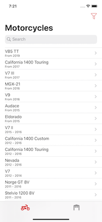
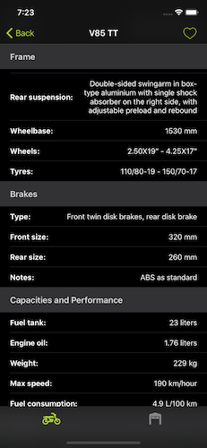
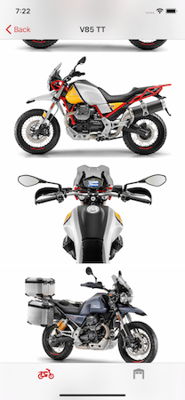
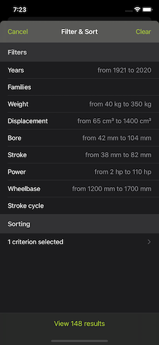
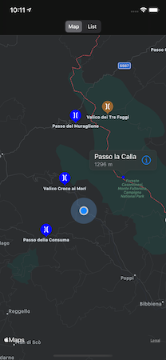
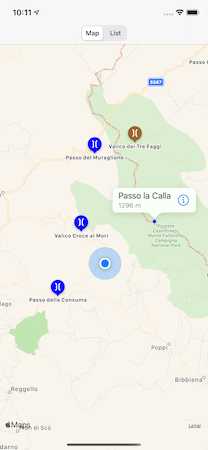
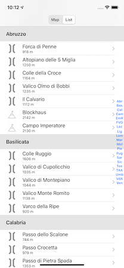
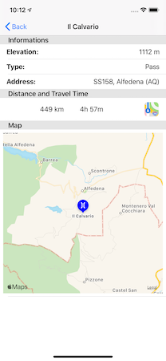

# Paolo Rocca

### iOS Developer

  

# Current Position

iOS Developer @ [Metide Srl](https://www.metide.com)

# Personal Projects

## Guzzi Tracker

   

Tecnologies: `Swift`, `UIKit`, `Carthage`, `Kingfisher`, `MVC`, `Codable`, `Measurement`, `Localization`

Guzzi Tracker was my first app developed from scratch. It's a reference guide of all the technical specs of (almost) all the motorcycles manufactured by Moto Guzzi since 1921. I developed the app between 2017 and 2018 and it was available on the App Store from september 2018 to december 2019.

The app it's entirely written in Swift (updated to version 5) using MVC architecture. There is only one external library, [Kingfisher](https://github.com/onevcat/Kingfisher), managed using Carthage. Few months ago I updated the app to support iOS 13 with Dark Mode, `.pageSheet` modal presentation style and automatic collection diffing. It also supports Master-Detail interface and readable content width. The app is localized in italian and english. I also experimented with a bit of functional programming while designing the filtering and sorting of the motorcycle list. 

I'm very proud of Guzzi Tracker, being my first real app, developed with no working experience and published on the App Store.

The project is available on the [Guzzi Tracker repo](https://github.com/hispanico94/Guzzi-Tracker).

## PassIT

   

Tecnologies: `Swift`, `UIKit`, `Carthage`, `MVVM`, `RxSwift/RxCocoa`, `RxDataSources`, `CoreLocation`, `MapKit`

PassIT is a toy project I developed between fall 2018 and winter 2019 while I was studying reactive programming using RxSwift and MVVM architecture. The app lists and shows on a map 438 road passes and road to mountain peaks in Italy. I took inspiration from my passion about motorcycles, just like Guzzi Tracker! For every pass o road peak some informations are reported, including name, address, elevation and distance and travel time from the user position calculated using `MKDirections`.

The app it's entirely written in Swift (updated to version 5) using a mix of MVC and MVVM architecture. It uses RxSwift and RxCocoa for reactive bindings, and RxDataSources for reactive data sources for table views. I created custom reactive extensions for MKDirections, MKMapView and CLLocationManager for simplifying the bindings. Like in Guzzi Tracker, here I also experimented a bit with functional programming, applying the concepts of the functional getters and setters exposed in the episodes [#6](https://www.pointfree.co/episodes/ep6-functional-setters), [#7](https://www.pointfree.co/episodes/ep7-setters-and-key-paths) and [#8](https://www.pointfree.co/episodes/ep8-getters-and-key-paths) of the [Point Free](https://www.pointfree.co) video series.

I really enjoyed studying reactive programming, RxSwift and MVVM and playing with them by creating this toy project. Now MVVM using RxSwift is my default way to go when working on real projects at my current company.

This project is available on the [PassIT repo](https://github.com/hispanico94/PassIT).
