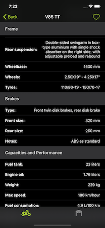

# Paolo Rocca

### iOS Developer

  

# Current Position

iOS Developer @ [Metide Srl](https://www.metide.com)

# Personal Projects

## Guzzi Tracker

   

Tecnologies: `Swift`, `UIKit`, `Carthage`, `Kingfisher`, `MVC`, `Codable`, `Measurement`, `Localization`

Guzzi Tracker was my first app developed from scratch. It's a reference guide of all the technical specs of (almost) all the motorcycles manufactured by Moto Guzzi since 1921. I developed the app between 2017 and 2018 and it was available on the App Store from september 2018 to december 2019.

The app it's entirely written in Swift 5 using MVC architecture. There is only one external library, [Kingfisher](https://github.com/onevcat/Kingfisher), managed using Carthage. Few months ago I updated the app to support iOS 13 with Dark Mode, `.pageSheet` modal presentation style and automatic collection diffing. It also supports Master-Detail interface and readable content width. The app is localized in italian and english. I also experimented with a bit of functional programming while designing the filtering and sorting of the motorcycle list. 

I'm very proud of Guzzi Tracker, being my first real app, developed with no working experience and published on the App Store.

The project is available on the [Guzzi Tracker repo](https://github.com/hispanico94/Guzzi-Tracker)
